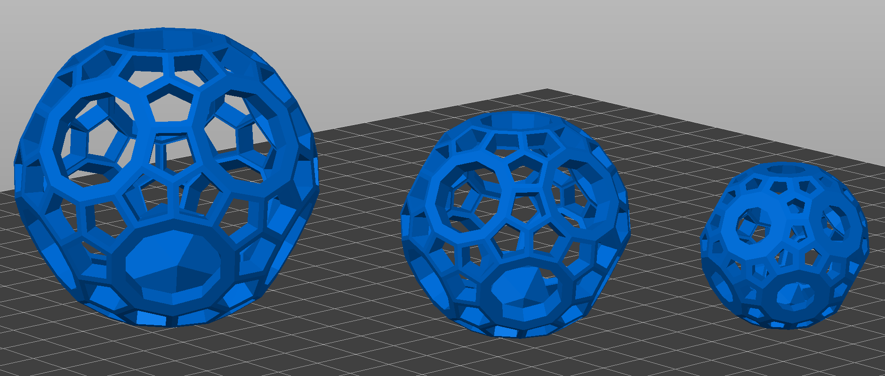

# OpenSCAD Cat Toy
Print in place cat toy, certified by my cats!

This is a simple print in place cat toy. The truncated icosahedron is generated at [http://kitwallace.co.uk/3d/solid-index.xq](http://kitwallace.co.uk/3d/solid-index.xq). 

The toy is printed in place, with a ball inside of an outer ball that can rattle around, this makes it more fun for the cats!

# Downloads
Check the [releases](https://github.com/diademiemi/openscad_cat_toy/releases) page for the latest downloads.

